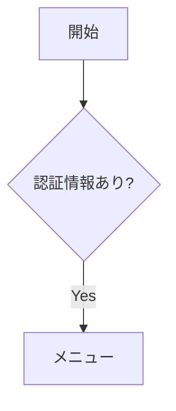
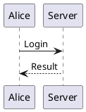

# MdFlow

Markdown、Mermaid、PlantUML、PowerPoint、ローカルLLMを一つの画面で扱うローカルWebアプリです。
Monaco Editorで仕様書を編集し、図を即時プレビューして、SVG・PNG・ZIP・PPTへ出力できます。

## 主な機能

- Monaco Editorの補完、検索、Undo、アウトライン、コマンドパレット
- 権限を与えた作業フォルダーのファイルエクスプローラー
- Mermaidの条件別ノードハイライトと開始～終了の全経路プリセット自動生成
- PlantUMLのローカルSVG描画、診断、ディスクキャッシュ、テンプレート
- SVG／倍率PNG／PDF印刷／全図ZIP／複数スライドPPT出力
- PPTに埋めたMarkdown・条件・図コードの復元とhash検証
- ファイル直接保存、自動保存、最近使ったファイル、外部変更検知、クラッシュ復旧
- Ollama／LM Studioを使ったストリーミング質問・編集
- LLM編集のDiff、確認、履歴、文章・図の保護、構文検証、ローカル関連検索

アプリは`127.0.0.1`でNiceGUIサーバーを起動し、ブラウザに独立したHTML UIを表示します。
Markdown、設定、LLMへの接続情報は外部サービスへ送信しません。

## セットアップ

Python 3.12を推奨します。

```powershell
python -m venv .venv
.venv\Scripts\python -m pip install -r requirements.txt
Copy-Item config.json.example config.json
.venv\Scripts\python scripts/fetch_markdown_it.py
.venv\Scripts\python scripts/fetch_mermaid.py
.venv\Scripts\python scripts/fetch_monaco.py
```

PlantUMLを使う場合はJavaと公式JARも準備します。

```powershell
powershell -ExecutionPolicy Bypass -File scripts/setup_plantuml_windows.ps1
```

このスクリプトはwingetでEclipse Temurin JREを導入し、SHA-256検証済みの固定PlantUML JARを
`mdflow/resources/vendor/plantuml/`へ配置します。既存の`plantuml`コマンド、または
`MDFLOW_PLANTUML`／`MDFLOW_PLANTUML_JAR`で指定した実行環境も利用できます。

## 起動

```powershell
run.bat
```

または次を実行します。

```powershell
.venv\Scripts\python -m mdflow
```

既定URLは`http://127.0.0.1:8080`です。`MDFLOW_PORT`でポートを変更できます。

## Markdownと図

````markdown


```mdflow-mapping
diagram: flow-login
presets:
  管理者:
    when: 'role == "admin"'
    active_nodes: [A, B, C]
style:
  active: 'fill:#ff9999,stroke:#333,stroke-width:2px'
```


````

条件式は`&& || ! == != < <= > >=`に対応し、`eval`を使わないAST評価を行います。
PlantUMLは外部サーバーを使わず、ローカルプロセスで描画します。

## ローカルLLM

標準でOllamaに対応し、LM StudioなどのOpenAI互換APIも選択できます。接続先はCodeWithPixieと
同じ`servers[]`／`active_server`形式の`config.json`で管理します。

```json
{
  "servers": [
    {
      "name": "LM Studio",
      "provider": "openai",
      "base_url": "http://127.0.0.1:1234/v1",
      "model": ""
    }
  ],
  "active_server": 0
}
```

`provider`は`openai`または`ollama`です。画面では登録済み接続先とロード済みモデルを選択でき、
選択結果は`config.json`へ保存されます。実ファイルはGit管理外で、APIキー項目は使用・公開しません。
別の設定ファイルを使う場合は`MDFLOW_CONFIG`にパスを指定できます。

```powershell
powershell -ExecutionPolicy Bypass -File scripts/setup_local_llm_windows.ps1 -Model "モデル名"
```

LM Studioの例:

```powershell
$env:MDFLOW_LLM_PROVIDER = "openai"
$env:MDFLOW_LLM_URL = "http://127.0.0.1:1234/v1"
$env:MDFLOW_LLM_MODEL = "モデル名"
```

タイムアウトや用途などの画面設定だけがブラウザ内に保存されます。質問対象は選択範囲、
現在の見出し、関連箇所、文書全体から選べます。関連検索は見出し単位の語句・日本語bigram一致を使う
ローカル処理です。編集案はMonaco Diffで確認し、図IDと`mdflow-mapping`を保護してから適用します。

## ファイルとエクスポート

Chromium系ブラウザではFile System Access APIによる直接上書き、自動保存、最近使ったファイル、
3秒ごとの外部変更検知を利用できます。未保存内容はブラウザ内へ退避され、次回起動時に復旧できます。
API非対応ブラウザではダウンロード保存へフォールバックします。

左端のEXPLORERで作業フォルダーを選ぶと、サブフォルダーとMarkdown／テキストファイルをツリー表示します。
選択したフォルダー以外は読み取らず、ブラウザに保存された権限が失効した場合は再承認を求めます。

図メニューの「全経路を自動生成」は、選択中のMermaid flowchartを解析し、開始から終了までの経路を
`自動経路 01`形式のプリセットとして`mdflow-mapping`へ保存します。手動プリセットは維持され、循環は
同じノードを二度通らない単純経路として扱います。経路爆発を防ぐため一度に生成するのは最大100件です。

MermaidとPlantUMLの図はSVG、1x～4x PNG、クリップボード、全図ZIP、複数スライドPPTへ出力できます。
PDFボタンは印刷専用レイアウトを開き、OSのPDF保存を利用します。

## CLI

```powershell
python -m mdflow.cli import output.pptx
python -m mdflow.cli export samples/login.md --diagram flow-login --image figure.png -o output.pptx
```

## テストと開発

```powershell
.venv\Scripts\python -m pip install -r requirements-dev.txt
.venv\Scripts\python -m playwright install chromium
.venv\Scripts\python -m pytest tests -q --browser chromium
.venv\Scripts\ruff check .
```

単体・PPT往復テストに加え、Playwright ChromiumでMonaco、検索・保存、アウトライン、復旧、図操作、
一括出力、LLM Diff・停止・確認を検証します。GitHub Actionsでも単体・静的解析・E2Eを実行します。

## 配布

`v*`タグまたは手動実行で、GitHub ActionsがWindows用`MdFlow.exe`とZIPを生成します。ローカルビルド:

```powershell
python scripts/fetch_markdown_it.py
python scripts/fetch_mermaid.py
python scripts/fetch_monaco.py
pyinstaller --noconfirm --clean --onefile --name MdFlow --paths . --collect-all nicegui --add-data "mdflow/resources;mdflow/resources" --add-data "samples;samples" scripts/mdflow_launcher.py
```

## 構成

```text
mdflow/
  app.py          NiceGUI/FastAPIエンドポイント
  document.py     Markdown・条件・図の統合ロジック
  mapping.py      安全な条件評価とプリセット
  mermaid.py      Mermaid解析とスタイル注入
  plantuml.py     PlantUML実行、診断、キャッシュ
  local_llm.py    Ollama／OpenAI互換クライアント
  llm_context.py  ローカル関連検索
  edit_safety.py  LLM編集の保護・自動修復
  pptx_io.py      PowerPoint入出力
  resources/      MonacoベースのWeb UI
tests/
  e2e/            Playwrightブラウザテスト
```

変更内容は[CHANGELOG.md](CHANGELOG.md)を参照してください。
