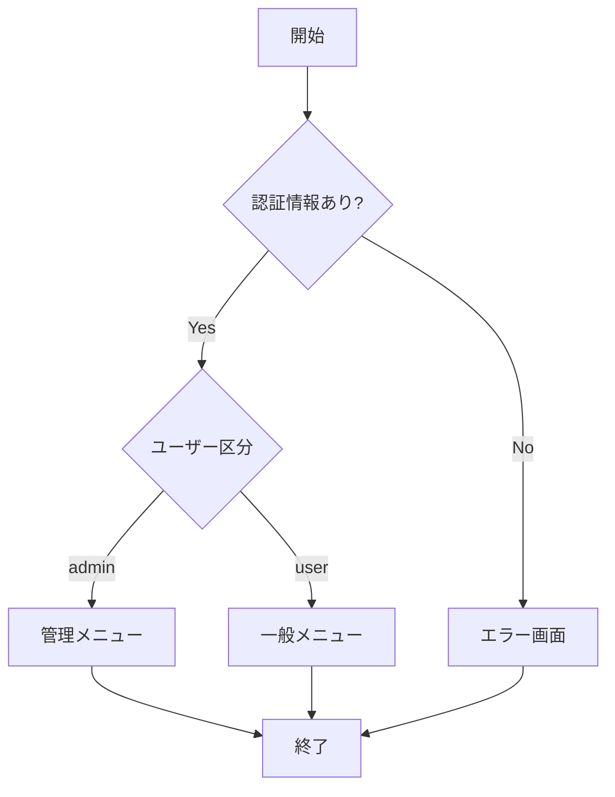

# ログイン処理仕様

本ドキュメントはログイン処理のフローと、条件別の通過ルートを定義する。

## フローチャート



## 条件マッピング

「どの条件のとき、どのノードを通るか」を図の近くで宣言する。
可読性とバージョン管理のしやすさのため、本文中のブロックとして持つ。

```mdflow-mapping
diagram: flow-login
presets:
  管理者・正常:
    when: 'role == "admin" && error_count == 0'
    active_nodes: [A, B, C, D, G]
  一般・正常:
    when: 'role == "user" && error_count == 0'
    active_nodes: [A, B, C, F, G]
  認証エラー:
    when: 'error_count > 0'
    active_nodes: [A, B, E, G]
style:
  active: 'fill:#ff9999,stroke:#333,stroke-width:2px'
```
